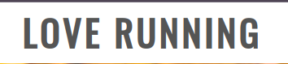
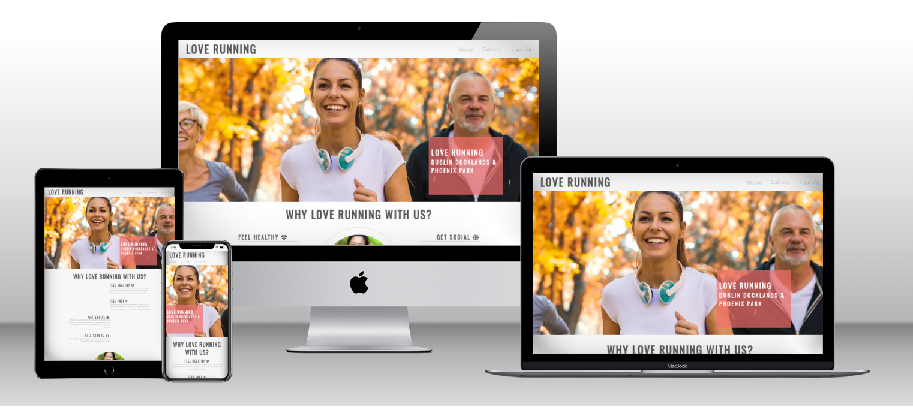

# LoveRunning

Love Running is a site that hopes to help keep people motivated to meet up for runs on a regular basis in Dublin, Ireland. The site will be targeted toward runners who are looking for a way to socialise and keep themselves fit. Love Running will be useful for runners to see exactly when and where they should be to join the running club.

This site can be accessed <a href="">here</a>

<em>A responsive website built entirely using HTML and CSS.</em>

## User Stories

### First Time Visitor:
<ul>
<li>As a first-time visitor, I want to land on a visually appealing homepage that introduces me to the website's purpose, key features, and provides easy navigation to relevant sections.</li>
<li>As a first-time visitor, I want to see gallery of photos.</li>
<li>As a first-time visitor, I want to signup for newsletter, so I can be updated with latest news and events</li>
</ul>

### Returning Visitor:
<ul>
<li>As a returning visitor I want to see any events in my area.</li>
<li>As a returning visitor, I want to see updated photos in the gallery section of the events</li>
<li>As a returning visitor, I want to meet up with other runners for a coffee.</li>
</ul>

### Frequent Visitor:
<ul>
<li>As a frequent visitor, I want to see if there are any updated events that I can take part in. </li>
<li>As a frequent visitor, I want to have option to connect to social media, so I can share the events I participated in with friends. </li>
</ul>

