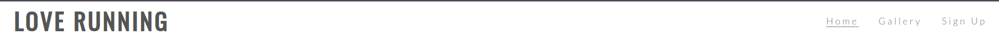
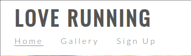

# LoveRunning
## Personal Note

Although this project is a walkthrough / follow along project for Full Stack Web Application Development lv5 course.  I did the README.md documentation by my self to practice documenting what I did for the project.   I also used issues in GitHub Projects to write this documentation so I can get familiar using GitHub Projects.   

By doing this documentation I have an idea on what the documentation requires and how to use GitHub projects.

Love Running is a site that hopes to help keep people motivated to meet up for runs on a regular basis in Dublin, Ireland. The site will be targeted toward runners who are looking for a way to socialise and keep themselves fit. Love Running will be useful for runners to see exactly when and where they should be to join the running club.

This site can be accessed <a href="https://taherccg.github.io/LoveRunning/">here.</a>

<em>A responsive website built entirely using HTML and CSS.</em>

## User Stories

### First Time Visitor:
<ul>
<li>As a first-time visitor, I want to land on a visually appealing homepage that introduces me to the website's purpose, key features, and provides easy navigation to relevant sections.</li>
<li>As a first-time visitor, I want to see gallery of photos.</li>
<li>As a first-time visitor, I want to signup for newsletter, so I can be updated with latest news and events</li>
</ul>

### Returning Visitor:
<ul>
<li>As a returning visitor I want to see any events in my area.</li>
<li>As a returning visitor, I want to see updated photos in the gallery section of the events</li>
<li>As a returning visitor, I want to meet up with other runners for a coffee.</li>
</ul>

### Frequent Visitor:
<ul>
<li>As a frequent visitor, I want to see if there are any updated events that I can take part in. </li>
<li>As a frequent visitor, I want to have option to connect to social media, so I can share the events I participated in with friends. </li>
</ul>

## Wireframe

### Home Page Wireframe

<ul>
<li>Desktop Wireframe</li>

<li>Tablet Wireframe</li>

<li>Mobile Phone Wireframe</li>

</ul>

## Features

<ul>
<li><strong>Navbar</strong></li>
<ul>
<li>Navigation</li>
<ul>
<li>Positioned at the top of the page.</li>
<li>Contains the Logo on the left side.</li>
<li>Contains navigation links on the right.</li>
<ul>
<li>HOME - leads to homepage / landing page</li>
<li>GALLERY - leads to the event photo gallery of users who participated. </li>
<li>SIGNUP - leads to a form where users can signup to participate in events.</li>
</ul>
<li>The links have a line under navigation text to show what page the user is in.</li>
<li>The navigation is clear and easy to understand.</li>

<li>The navigation bar is responsive: 
<ul>
<li>On tablets and phone the navigation is split into two lines.  Line 1 is the header line 2 is the navbar</li>

</ul>
</ul>
</ul>

<li><strong>Home page</strong></li>
<ul>
<li>Landing Page Image</li>
<ul>
<li>Hero image - Desktop</li>
<ul>
<li>The landing includes a photograph with text overlay to allow the user to see exactly which location this site would be applicable to.</li>
<li>Hero image - zooms in slightly to grab users attention with animation. </li>

</ul>
<li>Hero image - Tablets</li>
<ul>
<li>The hero image on tablet has been zoomed to the center and text overlay has been moved towards the left of the image.</li>

</ul>
<li>Hero image - Phone</li>
<ul>
<li>The hero image on the phone has been further zoomed to the center and text overlay has remains towards the left of the image.</li>

</ul>
</ul>

<li> Club Ethos Section</li>
<ul>
<li>Desktop View</li>
<ul>
<li>The club ethos section will allow the user to see the benefits of joining the Love Running meetups, as well as the benefits of running overall.</li>
<li>This user will see the value of signing up for the Love Running meetups. This should encourage the user to consider running as their form of exercise.</li>

</ul>
<li>Tablet View</li>
<ul>
<li>To display the club ethos section better on tablet.  The 1st to paragraphs have been moved left and the 2nd two paragraphs have been moved towards the right below the 1st paragraphs followed by the image, which is at the bottom center of the page. </li>

</ul>
<li>Phone View</li>
<ul>
<li>To display the club ethos section better on a phone.  All paragraphs have been moved into a single column blocks making the paragraphs and image clearly visible in order. </li>

</ul>
</ul>

<li>Meetup Times Section</li>
<ul>
<li>Desktop View</li>
<ul>
<li>This section will allow the user to see exactly when the meetups will happen, where they will be located and how long the run will be in kilometers.</li>
<li>This section will be updated as these times change to keep the user up to date.</li>

</ul>
<li>Tablet View</li>
<ul>
<li>To display the meetup times section better on a Tablet.  All event times have been moved into a single column blocks making the event times section visible in order.</li>
<li>All text has been centered.</li>

</ul>
<li>Phone View</li>
<ul>
<li>To display the club ethos section better on a phone.  All paragraphs have been moved into a single column blocks making the paragraphs and image clearly visible in order. </li>
<li>All text has been centered.</li>

</ul>
</ul>

<li>Footer Section</li>
<ul>
<li>Desktop View</li>
<ul>
<li>The footer section includes links to the relevant social media sites for Love Running. The links will open to a new tab to allow easy navigation for the user.</li>
<li>The footer is valuable to the user as it encourages them to keep connected via social media</li>

</ul>
<li>Tablet View</li>
<ul>

</ul>
<li>Phone View</li>
<ul>

</ul>
</ul>
</ul>

<li>Gallery Page </li>
<ul>
<li>Desktop View</li>
<ul>
<li>The gallery will provide the user with supporting images to see what the meet ups look like.</li>
<li>This section is valuable to the user as they will be able to easily identify the types of events the organisation puts together.</li>

</ul>
<li>Tablet View</li>
<ul>

</ul>
<li>Phone View</li>
<ul>

</ul>
</ul>
<li>Sign Up Form</li>
<ul>
<li>Desktop view</li>
<ul>
<li>This page will allow the user to get signed up to Love Running to start their running journey with the community. The user will be able specify if they would like to take part in road, trail or both types of running. The user will be asked to submit their full name and email address.</li>

</ul>
<li>Tablet view</li>
<ul>

</ul>
<li>Phone view</li>
<ul>

</ul>
</ul>
</ul>

## Future features to implement and improve
<ol>
<li>Add favicon</li>
<li>Add custom 404 page</li>
<li>Improve signup form</li>
<li>Add user account page so they can see how much have they ran in km/mi by participating in events.</li>
</ol>

## Testing

### Browser Tests
<ul>
<li>Chrome</li>

<li>Firefox</li>

<li>Brave</li>

<li>Opera</li>

</ul>

### W3C Validators

<ul>
<li>HTML</li>
<ul>
<li>index.html</li>

<li>gallery.html</li>

<li>signup.html</li>

</ul>
<li>CSS</li>
<ul>
<li>style.css</li>

</ul>
</ul>

## Deployment

This project is deployed on my GitHub account.

- The site was deployed to GitHub pages. The steps to deploy are as follows: 
  - In the GitHub repository, navigate to the Settings tab 
  - From the source section drop-down menu, select the main (master) Branch
  - Once the main branch has been selected, the page will be automatically refreshed with a detailed ribbon display to indicate the successful deployment. 

The live link can be found here - https://taherccg.github.io/LoveRunning/ 

## Credits 

All credits goto Code Institute as this is a walkthrough / follow along project for Full Stack Web Application Development lv5 course. 

### Content

All content was written while following the project videos for Full Stack Web Application Development lv5 course.

